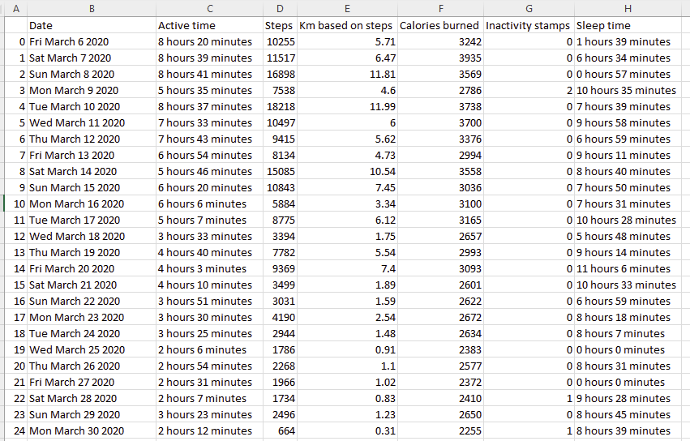
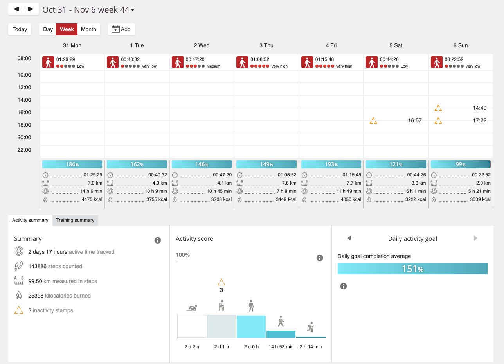
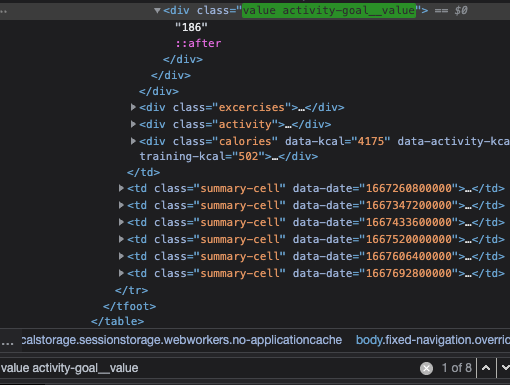
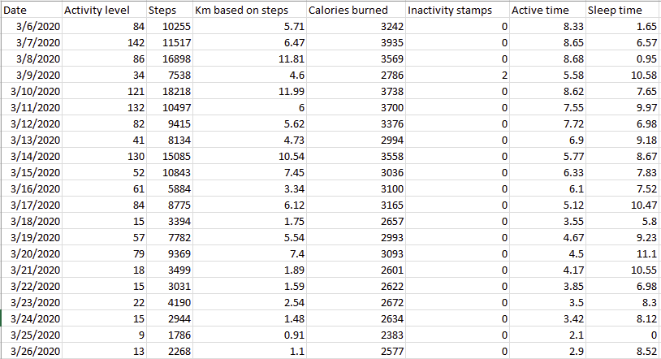
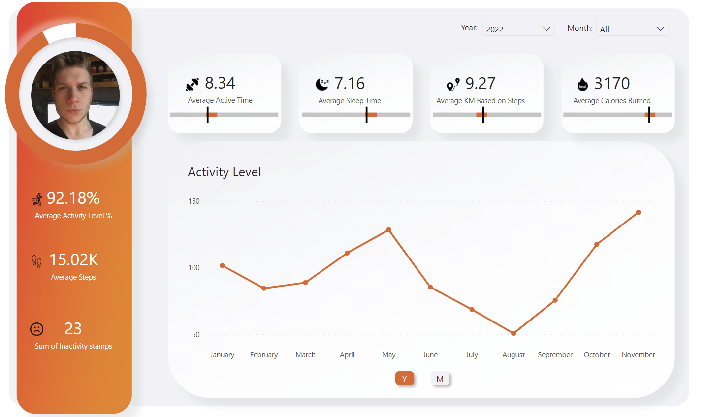
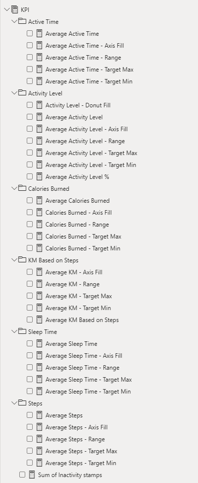
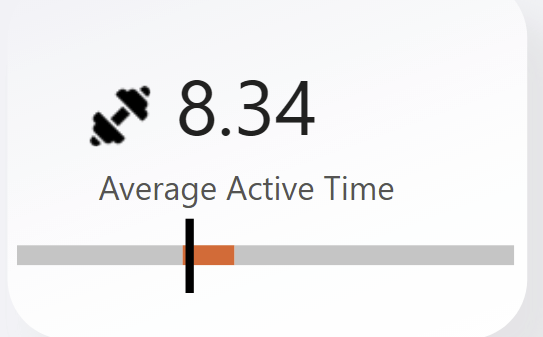
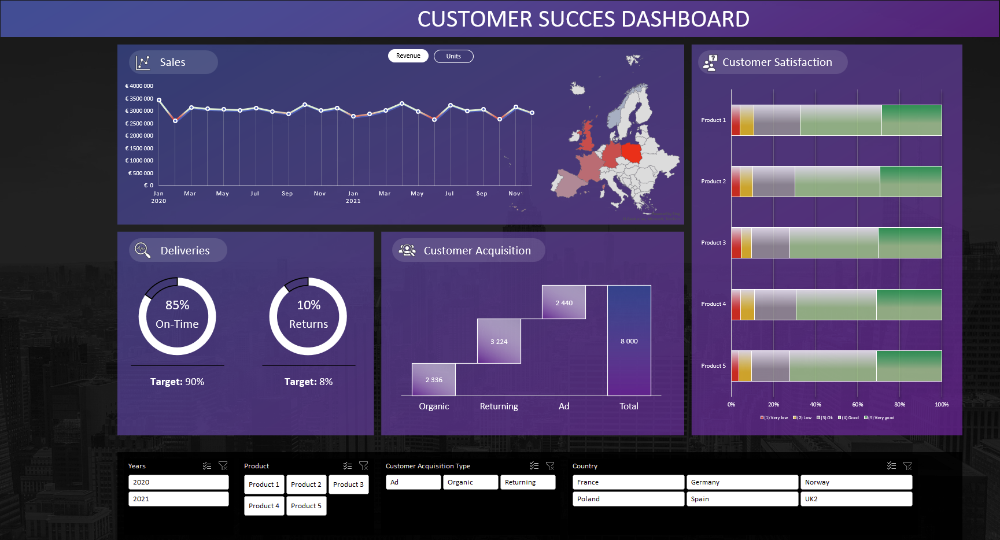

## Introduction

Hi! My name is Sebastian, and I'm Computer Science student (University of Economics in Katowice). 
During my studies, I acquired the knowledge necessary for the profession of a data analyst, and in my spare time, I strengthened my skills by courses and freelancing.

## Table of contents
- [Introduction](#introduction) 
- [Courses](#courses)
- [Technologies](#technologies)
- [Portfolio Projects](#portfolio-projects)

	- [**Scraping** Polar Flow, **Data Cleaning** and **Analysis in Power BI**](#scraping-polar-data-cleaning-analysis-in-power-bi)
	
	- [Creating fake dataset using **python**](#creating-fake-dataset-using-python)
		
	- [**EDA** of created fake dataset](#eda-of-created-fake-dataset)
		
	- [**Data Analysis** and excel **dynamic dashboard**](#data-analysis-and-excel-dynamic-dashboard)

- [Contact](#contact)
## Courses
All finished courses can be find in my [LinkedIn Profile](https://www.linkedin.com/in/se-domagala/details/certifications/)
## Technologies
- Excel (xlookup, pivot tables/tables, **Power Query, Power Pivot, Data Model**, macro)
	- Finished [Excel Skills For Business Specialization](https://www.coursera.org/specializations/excel)
	- During [Excel Skills for Data Analytics and Visualization Specialization](https://www.coursera.org/specializations/excel-data-analytics-visualization)
	
- Python (Pandas, NumPy, SciPy, Matplotlib, seaborn)
	- My bachelor's degree project is an artificial intelligence (Reinforcement Learning) algorithm for playing poker
	
- SQL (Join, subqueries, functions, read/update/delete)
	- During my studies, I learned SQL at an intermediate level

- Power BI (Data insight, **DAX**) 

## Portfolio Projects
In This section I will present my data analytics projects.

### Scraping Polar flow, Data Cleaning and Analysis in Power BI

**Code:** [Polar scraper.ipynb](https://github.com/maxiorex15625/Portfolio/blob/main/Polar%20Flow%20Project/Polar_scraper.ipynb)

**Description:** I scraped all data from [Polar Flow](https://flow.polar.com) since I got my watch (6th day of March 2020), cleaned data in **Power Query** and created app-like dashboard in **Power BI**.

**Technology:** Python (Selenium + BS4, Pandas), Excel (Power Query, Data Model), Power BI (DAX measures)

When planning, I wanted to use [Power Automate](https://powerautomate.microsoft.com/) from Microsoft, but it had serious problems with loop on pager. So I looked through web, and found out that Polar Flow has an own [API](https://www.polar.com/accesslink-api/#polar-accesslink-api). After 4 hours I gave up, I guess I haven't seen a worse API... 

Then I tried to do this with [Requests](https://requests.readthedocs.io/en/latest/) Session, but with same result as with API. So I decided to do this with Selenium (Beacouse of lovely JavaScript) + BS4.

After couple minutes, here is the result:

Steps, sleep time, calories burned etc.: 

Activity Level:

I had to add manually 4 zeroes at the beginning, but I will explain it later. 

At this point, I finally added my data to Power Query. Here is the M language code for query with all measures [M_measures](https://github.com/maxiorex15625/Portfolio/blob/main/Polar%20Flow%20Project/M_measures).

And here is the code for activity level [M_activity](https://github.com/maxiorex15625/Portfolio/blob/main/Polar%20Flow%20Project/M_activity)

As You can see, I removed alternate rows, but for what? 

Here is the table which I scraped.

And here is the source code of this page.

As You can see, there is 8 div's with class which I was looking for, and the 8th is the Average of daily goal completion (remove alternate rows). This is why I had to add four zeros at the begining, beacouse my starting date was 6th day of march, which is Friday. 

Now when my data is cleaned, I merged it into one based on Date. For this, I copied activity table, and replaced Index 1 with 2nd Day of March and used fill handle. 

Here is result:

And here is the interesting part, **Power BI** app-like dashboard. [Dashboard](https://app.powerbi.com/groups/me/reports/9a068507-a229-4693-a2c3-d83c7cc6a79a?ctid=8fbcdc7a-dff7-4113-b007-45612ef5b74d&pbi_source=linkShare)

I Created simple background in Power Point and saved it as SVG.

All measures 

Measures with: Axis Fill, Range, Target Min/Max was used for stacked bar chart. 

It was a very interesting project to do, mainly because I had to get the data myself. I encountered a few difficulties (Power Automate and Flow API to name few of them) but I am happy with the result.

### Creating fake dataset using python

**Code:** [Creating_Fake_Dataset.ipynb](https://github.com/maxiorex15625/Portfolio/blob/main/Creating_Fake_Dataset.ipynb)

**Description:** I couldn't find data, that would suit my excel dashboard, so I created my, fake dataset.

**Technology:** NumPy and Faker (Python)

### EDA of created fake dataset

**Code:** [Fakedata_EDA.ipynb](https://github.com/maxiorex15625/Portfolio/blob/main/Fakedata_EDA.ipynb)

**Description:** Simple EDA of dataset created in previous step.

**Technology:** Pandas, NumPy, seaborn
	
### Data Analysis and excel dynamic dashboard

**Description:** Data analysis of created fake dataset. I will present some screenshots as it is macro enabled workbook (xlsm)

**Technology:** Excel

This is how data table looks.

 Almost every column has data validation (lists) based on "lists" located in tables

And this is how dashboard presents. 

It is dynamically linked to dataset, so if there is new data, the dashboard will be updated (Pivot charts too)

Here is presentation of **Dynamic KPI** 

And also **Dynamic** chart with **option buttons**

I will present macro used in worksheet. If, for any reason you are concerned about opening this macro enabled worksheet

**Refreshing pivot charts macro** 

**Tab button macro (Revenue/Units)**

## Contact
- LinkedIn [@se-domagala](https://www.linkedin.com/in/se-domagala/)
- E-mail [se.domagala@gmail.com](se.domagala@gmail.com)
