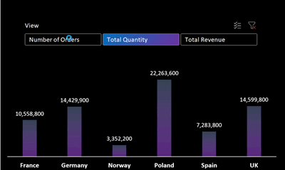

## Introduction

Hi! My name is Sebastian, and I'm Computer Science student (University of Economics in Katowice). 
During my studies, I acquired the knowledge necessary for the profession of a data analyst, and in my spare time, I strengthened my skills by courses and freelancing.

## Table of contents
- [Introduction](#introduction) 
- [Courses](#courses)
- [Technologies](#technologies)
- [Portfolio Projects](#portfolio-projects)

	- [Creating fake dataset using **python**](#creating-fake-dataset-using-python)
		
	- [**EDA** of created fake dataset](#eda-of-created-fake-dataset)
		
	- [**Data Analysis** and excel **dynamic dashboard**](#data-analysis-and-excel-dynamic-dashboard)

- [Contact](#contact)
## Courses
All finished courses can be find in my [LinkedIn Profile](https://www.linkedin.com/in/se-domagala/details/certifications/)
## Technologies
- Excel (xlookup, pivot tables/tables, **Power Query, Power Pivot, Data Model**, macro)
	- Finished [Excel Skills For Business Specialization](https://www.coursera.org/specializations/excel)
	- During [Excel Skills for Data Analytics and Visualization Specialization](https://www.coursera.org/specializations/excel-data-analytics-visualization)
	
- Python (Pandas, NumPy, SciPy, Matplotlib, seaborn)
	- My bachelor's degree project is an artificial intelligence (Reinforcement Learning) algorithm for playing poker
	
- SQL (Join, subqueries, functions, read/update/delete)
	- During my studies, I learned SQL at an intermediate level

- Power BI (Data insight, **DAX**) 

## Portfolio Projects
In This section I will present my data analytics projects.

### Creating fake dataset using python

**Code:** [Creating_Fake_Dataset.ipynb](https://github.com/maxiorex15625/Portfolio/blob/main/Creating_Fake_Dataset.ipynb)

**Description:** I couldn't find data, that would suit my excel dashboard, so I created my, fake dataset.

**Technology:** NumPy and Faker (Python)

### EDA of created fake dataset

**Code:** [Fakedata_EDA.ipynb](https://github.com/maxiorex15625/Portfolio/blob/main/Fakedata_EDA.ipynb)

**Description:** Simple EDA of dataset created in previous step.

**Technology:** Pandas, NumPy, seaborn
	
### Data Analysis and excel dynamic dashboard

**Description:** Data analysis of created fake dataset. I will present some screenshots as it is macro enabled workbook (xlsm)

This is how data table looks.

 Almost every column has data validation (lists) based on "lists" located in tables

And this is how dashboard presents. 

It is dynamically linked to dataset, so if there is new data, the dashboard will be updated (Pivot charts too)

Here is presentation of **Dynamic KPI** 

And also **Dynamic** chart with **option buttons**

I will present macro used in worksheet. If, for any reason you are concerned about opening this macro enabled worksheet

**Refreshing pivot charts macro** 

**Tab button macro (Revenue/Units)**

## Contact
- LinkedIn [@se-domagala](https://www.linkedin.com/in/se-domagala/)
- E-mail [se.domagala@gmail.com](se.domagala@gmail.com)
